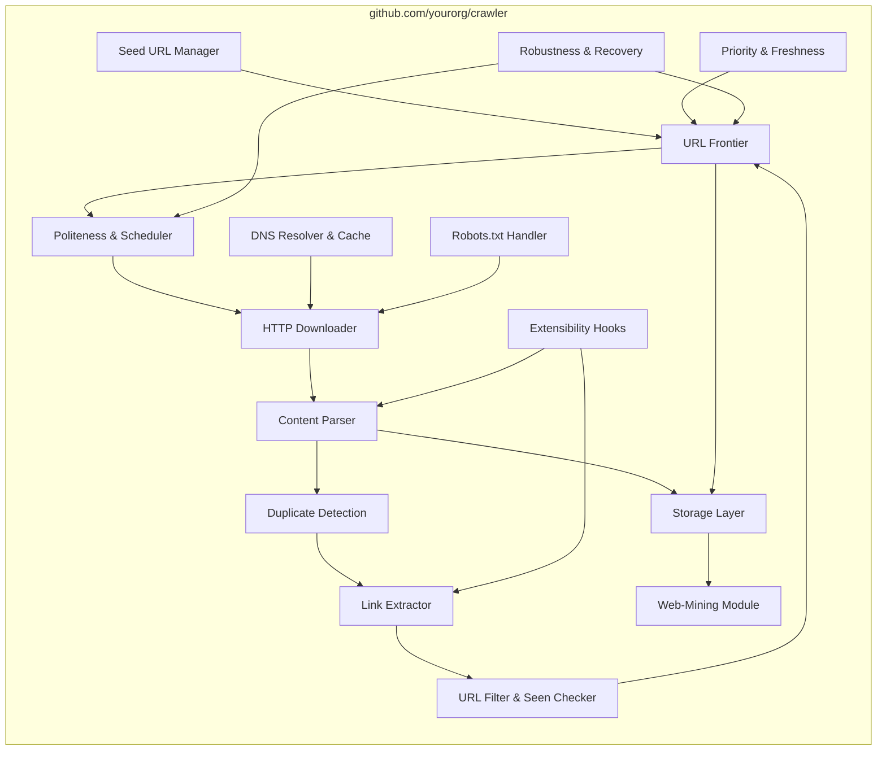

# Summary
This chapter focuses on designing a web crawler, which is also known as a robot or spider. Web crawlers are widely used by search engines to discover new or updated content on the web, including web pages, images, videos, and PDF files. A crawler starts by collecting a few web pages and then follows links on those pages to collect new content. Figure 9-1 is mentioned as showing a visual example of this crawl process.

![[Pasted image 20250516114652.png]]

Crawlers are used for various purposes:

- **Search engine indexing**: This is the most common use case, where a crawler collects pages to create a local index for search engines, like Googlebot for Google search.
- **Web archiving**: Collecting information to preserve data for future uses, practiced by entities like the US Library of Congress and the EU web archive.
- **Web mining**: Discovering useful knowledge from the internet, for example, financial firms using crawlers for shareholder meetings and annual reports.
- **Web monitoring**: Monitoring for copyright and trademark infringements, such as Digimarc utilizing crawlers.

The complexity of developing a web crawler depends on the scale it intends to support.

## Step 1 - Understand the problem and establish design scope

The basic algorithm of a web crawler is presented in three steps:

1. Given a set of URLs, download all the web pages addressed by the URLs.
2. Extract URLs from these web pages.
3. Add new URLs to the list of URLs to be downloaded and repeat.

Designing a vastly scalable web crawler is an extremely complex task, unlikely to be done within an interview duration. It is critical to ask clarification questions to understand requirements and establish the design scope. Examples of questions include the main purpose (search engine indexing, data mining, etc.), the number of pages to collect per month (e.g., 1 billion pages), supported content types (e.g., HTML only), whether newly added or edited pages are considered, if HTML pages need to be stored (and for how long, e.g., 5 years), and how to handle duplicate content.

Beyond functionalities, characteristics of a good web crawler are important:

- **Scalability**: Must be extremely efficient, using parallelization, as the web is very large.
- **Robustness**: Must handle traps like bad HTML, unresponsive servers, crashes, and malicious links.
- **Politeness**: Should not make too many requests to a website within a short time interval.
- **Extensibility**: The system should be flexible to support new content types with minimal changes.

Back of the envelope estimation for crawling 1 billion web pages per month:

- QPS: ~400 pages per second.
- Peak QPS: ~800 pages per second.
- Assuming an average page size of 500k, storage needed per month is 500 TB.
- Storage needed for five years of content is 30 PB.

## Step 2 - Propose high-level design and get buy-in

Inspired by previous studies, a high-level design is proposed, shown in Figure 9-2. The design components are described:

![[Pasted image 20250516115016.png]]

- **Seed URLs**: Starting points for the crawl process. Selecting good seed URLs is important for traversing as many links as possible, possibly by dividing the URL space by locality or topic. Figure 9-2 shows seed URLs as part of the design.
- **URL Frontier**: Stores URLs to be downloaded, often thought of as a FIFO queue. Figure 9-2 shows the URL Frontier component.
- **HTML Downloader**: Downloads web pages from the internet using URLs from the URL Frontier. Figure 9-2 shows this component.
- **DNS Resolver**: Translates URLs into IP addresses for the HTML Downloader. Figure 9-2 shows this component.
- **Content Parser**: Parses and validates downloaded web pages to avoid problems from malformed pages. It is a separate component to avoid slowing down the crawling process. Figure 9-2 shows this component.
- **Content Seen?**: A data structure to eliminate data redundancy by detecting previously stored content, typically comparing hash values of web pages instead of character-by-character comparison. Figure 9-2 shows this component.
- **Content Storage**: Stores HTML content, using disk for most data and memory for popular content to reduce latency. Figure 9-2 shows this component.
- **URL Extractor**: Parses HTML pages to extract links. Figure 9-3 is referenced as showing an example of relative paths converted to absolute URLs. Figure 9-2 shows this component.
![[Pasted image 20250516115207.png]]
- **URL Storage**: Stores already visited URLs. Figure 9-2 shows this component.

The web crawler workflow is explained step-by-step with reference to Figure 9-4:
![[Pasted image 20250516115347.png]]
1. Add seed URLs to the URL Frontier.
2. HTML Downloader fetches URLs from URL Frontier.
3. HTML Downloader gets IP addresses from DNS resolver and starts downloading.
4. Content Parser parses HTML pages and checks for malformed pages.
5. Parsed and validated content is passed to the “Content Seen?” component.
6. “Content Seen” checks if the content is already stored. If yes (duplicate content), the page is discarded. If no, the content is passed to Link Extractor.
7. Link Extractor extracts links.
8. Extracted links are passed to the URL filter.
9. Filtered links are passed to the “URL Seen?” component.
10. “URL Seen” checks if a URL has been processed before. If yes, nothing is done.
11. If a URL has not been processed, it is added to the URL Frontier.

## Step 3 - Design deep dive

This section dives into important building components and techniques.

### DFS vs BFS

The web can be seen as a directed graph. DFS (Depth-first search) is usually not a good choice for crawling due to the potentially very deep depth. BFS (Breadth-first search) is commonly used and implemented with a FIFO queue. However, standard BFS has two problems:

- It can lead to being "impolite" by processing too many links from the same host, potentially flooding servers. Figure 9-5 illustrates this problem with links from the same web page.
- It does not consider URL priority.

### URL frontier

The URL frontier addresses the problems with standard BFS and stores URLs to be downloaded. It is important for politeness, URL prioritization, and freshness. Findings from reference materials and are mentioned.

- **Politeness**: Avoid sending too many requests to the same host in a short period, often by downloading one page at a time per host with added delays. Figure 9-6 shows a design that manages politeness using a queue router, mapping table, FIFO queues per host, queue selector, and worker threads.
![[Pasted image 20250516115544.png]]
- **Priority**: Prioritizing URLs based on usefulness (e.g., PageRank, traffic, update frequency). The "Prioritizer" component handles this. Figure 9-7 shows a design managing priority using a Prioritizer and prioritized queues. Figure 9-8 presents the combined URL frontier design with front queues for priority and back queues for politeness.
![[Pasted image 20250516140940.png]]

![[Pasted image 20250516141030.png]]
- **Freshness**: Periodically recrawling pages to keep the data set fresh. Strategies include recrawling based on update history and prioritizing important pages for more frequent recrawling.
- **Storage for URL Frontier**: A hybrid approach is used, storing the majority of URLs on disk for space and maintaining buffers in memory for faster enqueue/dequeue operations, with data periodically written to disk.

### HTML Downloader

Downloads web pages using HTTP.

- **Robots.txt**: Crawlers should check and follow the rules specified in robots.txt files on websites before crawling. Caching robots.txt files is recommended to avoid repeat downloads. An example from [amazon.com's robots.txt](https://www.amazon.com/robots.txt) is provided.
- **Performance optimization**:
    - **Distributed crawl**: Distributing crawl jobs across multiple servers with multiple threads, partitioning the URL space. Figure 9-9 shows an example of a distributed crawl.
    - **Cache DNS Resolver**: Maintaining a DNS cache to avoid slow, synchronous DNS requests which can bottleneck crawler threads.
    - **Locality**: Distributing crawl servers geographically closer to website hosts for faster download times.
    - **Short timeout**: Setting a maximum wait time for unresponsive servers to avoid long waits.

### Robustness

Approaches to improve system robustness:

- **Consistent hashing**: Distributing loads among downloaders and handling server addition/removal. Chapter 5 is referenced for more details.
- **Save crawl states and data**: Writing states and data to storage to allow easy restart after failures.
- **Exception handling**: Handling errors gracefully without crashing the system.
- **Data validation**: Preventing system errors through validation.

### Extensibility

Designing the system flexibly to support new content types (like PNG files) or modules (like a Web Monitor) by plugging them in. Figure 9-10 shows how new modules can be added.

### Detect and avoid problematic content

Discusses detecting and preventing redundant, meaningless, or harmful content.

- **Redundant content**: Detected using hashes or checksums.
- **Spider traps**: Web pages causing infinite loops. Can be avoided by setting a maximal URL length, but no one-size-fits-all automatic solution exists. Manual verification and customized filters might be needed.
- **Data noise**: Content with little value like advertisements, code snippets, or spam URLs, which should be excluded.

## Step 4 - Wrap up

The chapter summary highlights the characteristics of a good crawler (scalability, politeness, extensibility, robustness) and key components discussed.

Additional talking points if time allows in an interview include:

- **Server-side rendering**: Needed to retrieve dynamically generated links from pages using scripts like JavaScript or AJAX. Figure 9-12 from Google is referenced for dynamic rendering.
- **Filter out unwanted pages**: Using an anti-spam component to filter out low-quality and spam pages.
- **Database replication and sharding**: Techniques to improve availability, scalability, and reliability of the data layer.
- **Horizontal scaling**: Keeping servers stateless to easily scale by adding servers.
- **Availability, consistency, and reliability**: Core concepts discussed in Chapter 1, important for large systems.
- **Analytics**: Collecting and analyzing data for fine-tuning the system.

# Implementation



## Package & Interface Sketches

```go
// seedmanager/seedmanager.go
package seedmanager

// Seeder provides initial URLs to start crawling.
type Seeder interface {
    LoadSeeds() ([]string, error)
}
```

```go
// frontier/frontier.go
package frontier

// Frontier manages the queue of URLs to be crawled.
type Frontier interface {
    Enqueue(url string, priority int) error
    Dequeue() (url string, ok bool)
    Size() int
}
```

```go
// resolver/resolver.go
package resolver

// Resolver looks up hostnames and caches IPs.
type Resolver interface {
    Lookup(host string) (ips []string, err error)
    Invalidate(host string)
}
```

```go
// robots/robots.go
package robots

// RobotsHandler fetches and enforces robots.txt rules.
type RobotsHandler interface {
    Allowed(url string) bool
    FetchAndParse(host string) error
}
```

```go
// downloader/downloader.go
package downloader

import "net/http"

// Downloader fetches HTTP content with retry and timeout.
type Downloader interface {
    Fetch(req *http.Request) (*http.Response, error)
}
```

```go
// parser/parser.go
package parser

// Parser cleans and parses HTML into a DOM-like tree.
type Parser interface {
    Parse(rawHTML []byte) (Document, error)
}

// Document represents a simplified HTML document.
type Document interface {
    Links() []string      // extract hrefs
    Text() string         // cleaned text
}
```

```go
// deduper/deduper.go
package deduper

// Deduper detects duplicate content by hash.
type Deduper interface {
    Seen(hash string) bool
    Mark(hash string)
}
```

```go
// extractor/extractor.go
package extractor

// Extractor normalizes and emits candidate URLs.
type Extractor interface {
    Extract(doc parser.Document) ([]string, error)
}
```

```go
// filter/filter.go
package filter

// Filter both validates URL patterns and checks seen-URLs.
type Filter interface {
    Allow(url string) bool
    MarkSeen(url string)
    Seen(url string) bool
}
```

```go
// storage/storage.go
package storage

// ContentStore persists page data.
type ContentStore interface {
    Save(url string, content []byte) error
}

// URLStore logs seen URLs for audit.
type URLStore interface {
    Archive(url string) error
}
```

```go
// scheduler/politeness.go
package scheduler

// Politeness enforces per-host delays and global throttling.
type Politeness interface {
    Wait(host string) error
    NotifyDone(host string)
}
```

```go
// freshness/freshness.go
package freshness

// Freshness scores URLs to drive recrawls.
type Freshness interface {
    Score(url string) int
}
```

```go
// recovery/recovery.go
package recovery

import "time"

// Checkpointer snapshots and restores crawler state.
type Checkpointer interface {
    Checkpoint() error
    Restore() (state []byte, err error)
    Schedule(interval time.Duration)
}
```

```go
// plugins/plugins.go
package plugins

import "github.com/yourorg/crawler/parser"

// ContentPlugin processes custom content types.
type ContentPlugin interface {
    Handles(mime string) bool
    Process(data []byte) error
}

// LinkPlugin can modify or enrich extracted links.
type LinkPlugin interface {
    Apply(url string) (string, error)
}
```

```go
// miner/miner.go
package miner

// Miner runs post-crawl knowledge extraction tasks.
type Miner interface {
    Analyze(raw []byte) (structured interface{}, err error)
}
```


# Notes

![[Pasted image 20250516141915.png]]